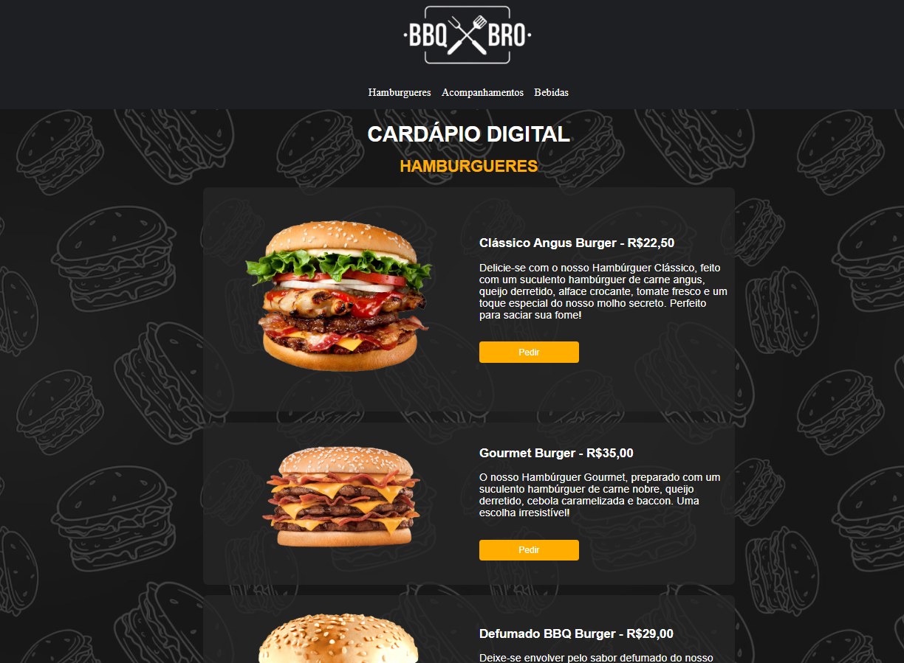

<h1 align="center">BBQ BRO</h1>

## 💻 Projeto

Este projeto foi feito para a conclusão do módulo de HTML e CSS do Curso de Desenvolvimento Fullstack da Youth Space.
Consiste em um cardápio digital responsivo da BBQ BRO, onde o usuário consegue visualizar o cardápio e navegar entre as seções de lanches.

## 🚀 Tecnologias utilizadas

- HTML5
- CSS3

## Acesse a página do projeto [clicando aqui](https://antoniorafaeldev.github.io/bbq-bro/)

## Autor - Antonio Rafael
- [GitHub](https://github.com/antoniorafaeldev)
- [LinkedIn](https://www.linkedin.com/in/ant%C3%B4nio-rafael-01131b372/)
- [Instagram](https://www.instagram.com/antonio.rafael.dev/)